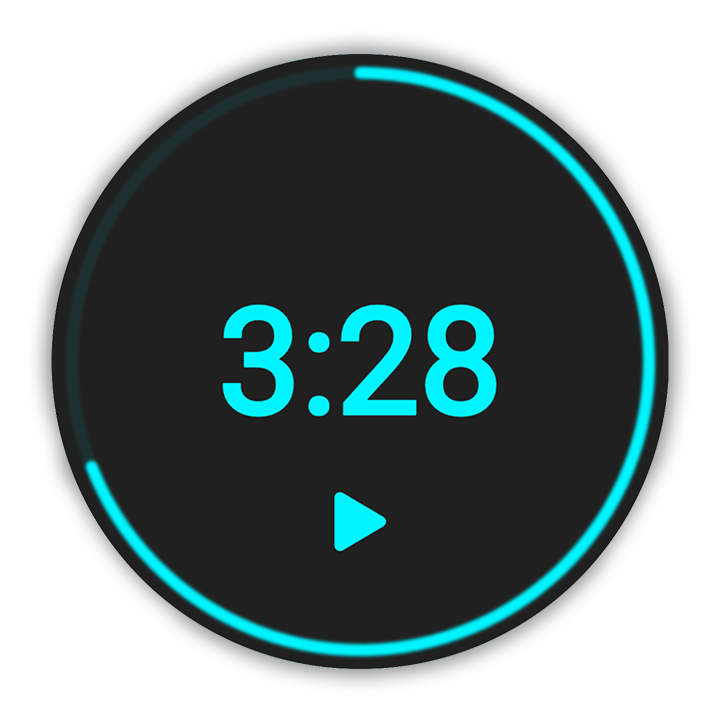
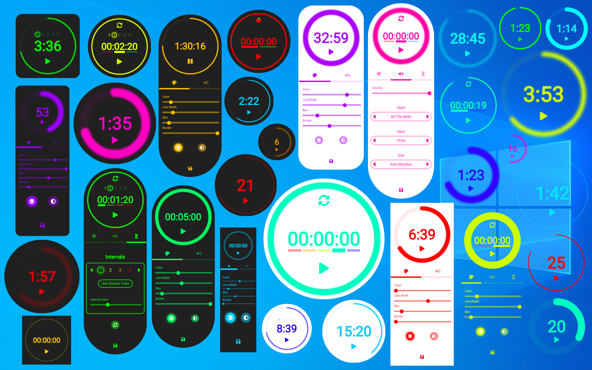
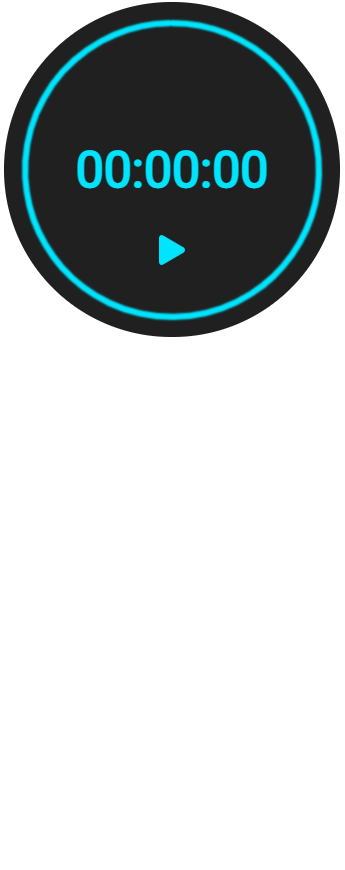
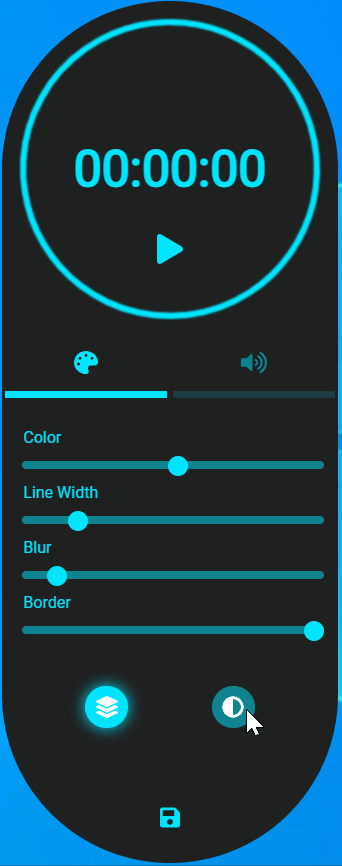
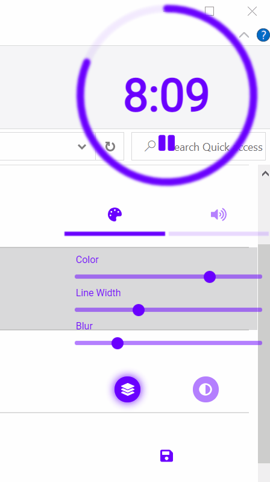

# Tempor
### A high utility, highly customizable, simple desktop timer app

Tempor is an Electron.js timer app that offers a high degree of customization. It's ideal for streamers, presenters,
coaches, & project leaders with its stylistic customization and flexible favorites

## Features:

### Style Customization

- 3 themes: light, dark, and transparent, to fit any environment
- Size: can be as big or as small as you need
- Color: Full range of color hues to match any style
- Blur: for a lighter, fuzzier look
- Circle thickness: for a bolder or more minimal look
- Border roundness: to fit in with any set of windows
- Always-on-top option: to make full use of your screen without losing sight of the time

### Favorites

- Save up to 5 favorites in each mode
- Easily load and set favorites quickly with key commands
- Set temporary favorites for the current session only, or save them permanently

### Interval Mode

- Add up to 5 custom intervals
- Choose a unique color for each interval
- Option to repeat entire interval cycle for a continuous loop

### Sound Customization

- Choose your own sounds
- Select different sounds for different event types
- Set volume independent from OS

### Usability

- Full set of key-commands for effortless operation
- Save your configuration, so it's always ready to go when you need it
- Easily move the window around with the hidden drag bar

## Styling & Configuration Examples:

# Instructions:

## General Usage

| Action  | Explanation | Key Command  | With Mouse |
| ------------- | :-------------  | :-------------: | :-------------: |
| Positioning | There's a hidden bar between the top of the progress circle and the top edge of the app. Click just above the timer circle and drag to position |  None |   |
| Open/Close Settings | Opens the tray where you will find style and audio settings, and interval settings when in interval mode | <kbd>s</kbd>  |   |
| Cycle Themes | Cycle between light, dark, and transparent themes | <kbd>b</kbd>  |   |
| Always on Top | When in always-on-top mode, you can interact with any window below without covering up the timer. You can't click through the timer, so you'll have to move it if you need to access a control below the window | <kbd>t</kbd>  |   |
| 